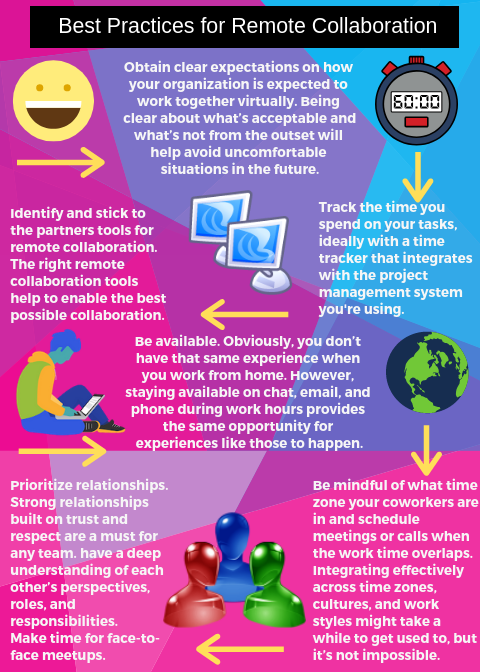
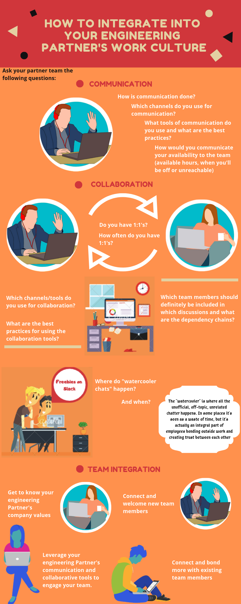

### **Distributed Engineering Teams Best Practices**
**The Difference between a Remote and a Distributed Team**

The future of work is remote because the [Global Mobile Workforce Forecast Update](https://www.strategyanalytics.com/access-services/enterprise/mobile-workforce/market-data/report-detail/global-mobile-workforce-forecast-update-2016-2022#.WCPg5Mn5Tcs) estimates that 1.87 billion employees which is over 40% of the world’s working population will be mobile or work remotely by 2022.

At Andela, the software development team you will be working with is called your Partner. Your partner team can be located anywhere across the globe and you will have to work remotely with the team.

A remote team is quite different from a distributed team. Didn’t know that? Well let’s have a look at the difference.

A remote team has no physical onsite office and team members are dispersed across the globe and can work from any location such as home offices or cafes.

A distributed engineering team is a software development team that consists of a hybrid of onsite and remote team members. It includes a physical office where some team members work from as well as other members of the team working from other locations.

--------

**Remote Communication Best Practices in a Distributed Engineering Team**

Distributed teams must have good communication strategies, technology, tools and best practices to survive and thrive while working remotely.

Here are the do’s and don’ts of remote communication in a distributed team:

###### [source 1](https://blog.aha.io/remote-team-instant-message/)
###### [source 2](https://www.collaborationsuperpowers.com/86-the-top-3-dos-and-donts-of-remote-working/)

-----

**Remote Collaboration Best Practices in a Distributed Engineering Team**

Effective remote collaboration occurs when the distributed team is able to produce results that meets its goals as the team members work together using collaboration tools from different locations in the world.

Here are best practices for remote collaboration in a distributed engineering team:

###### [source 1](https://hiring.monster.ca/hr/hr-best-practices/workforce-management/global-hr-management/best-practices-for-remote-collaboration.aspx)
###### [source 2](https://medium.com/swlh/how-to-collaborate-effectively-with-remote-colleagues-a5ef2b356fd1)

-------

**Remote Culture Best Practices in a Distributed Engineering Team**

Remote team culture is the way diverse members of a distributed team work together as a unit. This is the way they communicate and collaborate as they achieve a common goal even while working from different locations and coming from different cultural backgrounds.

Here are best practices for proper integration into your partner team’s work culture:

###### [source 1](https://toggl.com/out-of-office-remote-company-culture/)

Study Resources
----------------

| Topic   |  Web Link      |
|:---------|:----------|
| * Challenges and benefits of distributed teams|https://www.tecla.io/blog/distributed-teams-vs-remote-teams-from-the-physical-hq-to-the-100-virtual-office/|
| * The do’s and don’ts of remote communication|https://blog.aha.io/remote-team-instant-message/|
| * The tops 3 do’s and don’ts of remote working|https://www.collaborationsuperpowers.com/86-the-top-3-dos-and-donts-of-remote-working/|
| * Best Practices for Remote Collaboration|https://hiring.monster.ca/hr/hr-best-practices/workforce-management/global-hr-management/best-practices-for-remote-collaboration.aspx|
| * How to collaborate effectively with remote colleagues|https://medium.com/swlh/how-to-collaborate-effectively-with-remote-colleagues-a5ef2b356fd1|
| * What does Team Culture mean?|https://toggl.com/out-of-office-remote-company-culture/|
